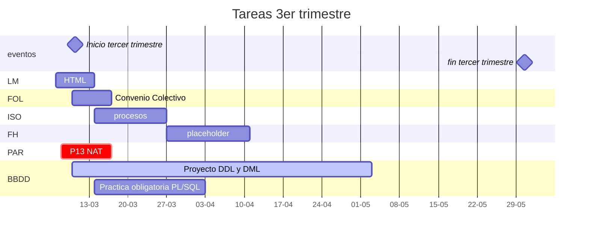

# Próximas actividades
---

[indices](indices.md)

## HORARIO

|    Lunes     |  Martes  | Miércoles |  Jueves  |   Viernes    |
|:------------:|:--------:|:---------:|:--------:|:------------:|
|      BD      | Hardware | Sistemas  |    BD    |      BD      |
|      BD      | Sistemas | Sistemas  |  Redes   | Programación |
| Programación | Sistemas | Hardware  |  Redes   | Programación |
|      -       |    -     |     -     |    -     |      -       |
| Programación |   FOL    | Hardware  |   FOL    |     FOL      |
|   Sistemas   |  Redes   |    BD     | Sistemas |    Redes     |
|   Sistemas   |  Redes   |    BD     | Sistemas |    Redes     |

