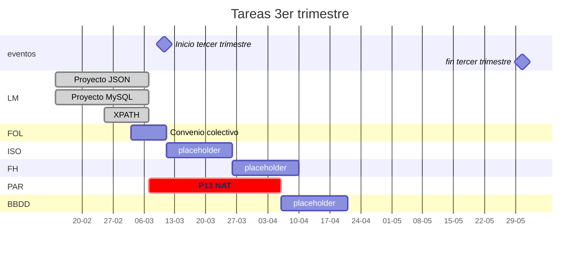

# Diagrama gantt de actividades próximas
---

# Índice

---
## ISO
1. Programación de tareas
2. Compara archivos
3. Sistemas de ficheros
4. [Permisos UGOA](iso/permisosUgoa.md)
5. Creación de usuarios y política de privacidad
6. [Creación de usuarios en modo batch](iso/usuariosbash.md)

## HORARIO

---

| Lunes | Martes | Miércoles | Jueves | Viernes |
|:-----:|:------:|:---------:|:------:|:-------:|
| BBDD  | FH     | ISO       | BBDD   | BBDD    |
| BBDD  | ISO    | ISO       | PAR    | LM      |
| LM    | ISO    | FH        | PAR    | LM      |
| -     | -      | -         | -      | -       |
| LM    | FOL    | FH        | FOL    | FOL     |
| ISO   | PAR    | BBDD      | ISO    | PAR     |
| ISO   | PAR    | BBDD      | ISO    | PAR     |

| Lunes | Martes | Miércoles | Jueves | Viernes |
|:-----:|:------:|:---------:|:------:|:-------:|
| BD  | Hardware     | Sistemas       | BD   | BD    |
| BD  | Sistemas    | Sistemas       | Redes    | Programación      |
| Programación    | Sistemas    | Hardware        | Redes    | Programación      |
| -     | -      | -         | -      | -       |
| Programación    | FOL    | Hardware        | FOL    | FOL     |
| Sistemas   | Redes    | BBDD      | Sistemas    | Redes     |
| Sistemas   | Redes    | BBDD      | Sistemas    | Redes     |

BBDD :arrow_right: Bases de Datos

LM :arrow_right: Lenguajes de Marcas

ISO :arrow_right: Implantación de Sistemas Operativos

FH :arrow_right: Fundamentos de Hardware

FOL :arrow_right: Formación y Orientación Laboral

PAR :arrow_right: Planificación y Administración de Redes