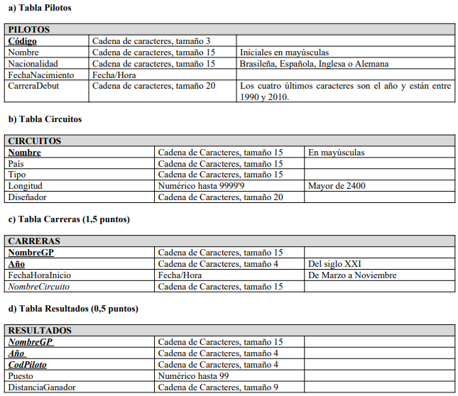

\addtolength{\oddsidemargin}{-.875in}
\addtolength{\evensidemargin}{-.875in}
\addtolength{\textwidth}{1.75in}

\addtolength{\topmargin}{-.875in}
\addtolength{\textheight}{1.75in}
\begin{center}
\begin{Huge}
\vspace*{\fill}

\textbf{Práctica obligatoria UD 4}

\vspace*{\fill}
\end{Huge}

\vfill

\LARGE{Roberto Rodríguez Márquez 1º ASIR}
\end{center}


\newpage

# Índice
- [Creación de tablas\dotfill 3](#id-section1)

\newpage
<div id='id-section1'/>
# Creación de tablas

## hay que crear la siguiente estructura
$\\$




1. **Tabla Pilotos**

```sql
CREATE TABLE Pilotos
(
codigo VARCHAR2(3),
nombre VARCHAR2(15),
nacionalidad VARCHAR2(15),
fechaNacimiento DATE,
carreraDebut VARCHAR2(20),
CONSTRAINT PK_Pilotos PRIMARY KEY (codigo),
CONSTRAINT MAY_nombre CHECK (nombre = INITCAP(nombre)),
CONSTRAINT C_carreraDebut CHECK
(SUBSTR(carreraDebut,-1,4) BETWEEN 1990 AND 2010),
CONSTRAINT C_nacionalidad CHECK
(nacionalidad IN ('Brasileña','Española','Inglesa','Alemana'))
);
```
2. **Tabla Circuitos**

```sql
CREATE TABLE Circuitos
(
nombre VARCHAR2(15),
pais VARCHAR2(15),
tipo VARCHAR2(15),
longitud NUMBER(5,1),
disenador VARCHAR2(20),
CONSTRAINT PK_Circuitos PRIMARY KEY (nombre),
CONSTRAINT MAYUS_nombre CHECK (nombre = UPPER(nombre)),
CONSTRAINT C_Centros_longitud CHECK (longitud > 2400)
);
```
3. **Tabla Carreras**

```sql
CREATE TABLE Carreras
(
nombreGP VARCHAR2(15),
anio VARCHAR2(15),
fechaHoraInicio DATE,
nombreCircuito VARCHAR2(15),
CONSTRAINT PK_Carreras PRIMARY KEY (nombreGP,anio),
CONSTRAINT FK_Carreras FOREIGN KEY (nombreCircuito) REFERENCES Circuitos (nombre),
CONSTRAINT MIN_anio_carreras CHECK (anio > 2000),
CONSTRAINT INTER_fechaHoraInicio CHECK
(EXTRACT(month FROM fechahoraInicio) BETWEEN 03 and 11)
);
```
4. **Tabla Resultados**

```sql
CREATE TABLE Resultados
(
nombreGP VARCHAR2(15),
anio VARCHAR2(4),
codPiloto VARCHAR2(4),
puesto NUMBER(2),
distanciaGanador VARCHAR2(9),
CONSTRAINT PK_Resultados PRIMARY KEY (nombreGP,anio,codPiloto),
CONSTRAINT FK_Carreras_Resultados FOREIGN KEY
(nombreGP,anio) REFERENCES Carreras (nombreGP,anio),
CONSTRAINT FK_pilotos_resultados FOREIGN KEY
(codPiloto) REFERENCES Pilotos (codigo)
);
```
## Introducimos datos de prueba

```sql
INSERT INTO Pilotos VALUES ('111','Roberto','Española',DATE '1998-10-18','carrera 1 2005');
INSERT INTO Pilotos VALUES ('112','Antonio','Inglesa',DATE '1993-06-18','carrera 2 2006');
INSERT INTO Pilotos VALUES ('113','Pedro','Alemana',DATE '1999-12-03','carrera 3 2006');

INSERT INTO Circuitos VALUES('DOS HERMANAS','Alemania','cerrado',3000,'Roberto');
INSERT INTO Circuitos VALUES('SEVILLA','Alemania','cerrado',9450.5,'Roberto');
INSERT INTO Circuitos VALUES('CIRCUITO NUEVO','Alemania','cerrado',6500,'Roberto');

INSERT INTO Carreras VALUES('segundo GP','2004',DATE'2004-07-07','DOS HERMANAS');
INSERT INTO Carreras VALUES('tercer GP','2007',DATE'2007-04-07','DOS HERMANAS');
INSERT INTO Carreras VALUES('primer GP','2004',DATE'2004-06-06','DOS HERMANAS');

INSERT INTO Resultados VALUES('segundo GP','2004',111,1,'0m');
INSERT INTO Resultados VALUES('primer GP','2004',112,1,'0m');
INSERT INTO Resultados VALUES('primer GP','2004',113,1,'0m');
```


