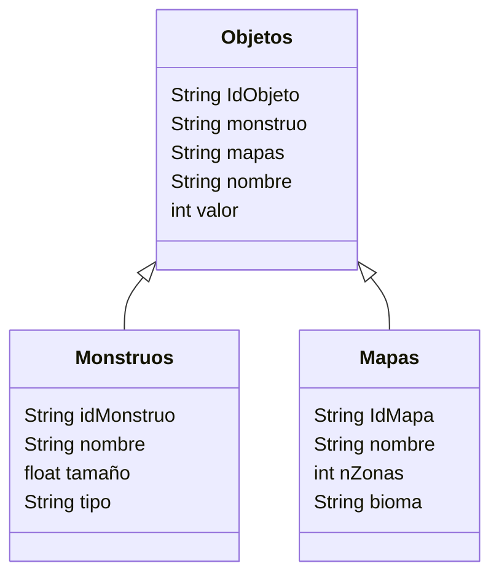

# diseño de la base de datos:

```mermaid
    classDiagram
        Objetos <|--Monstruos
        Objetos <|--Mapas
        class Objetos{
            String IdObjeto
            String monstruo
            String mapas
            String nombre
            int valor
        }
        class Monstruos{
            String idMonstruo
            String nombre
            float tamaño
            String tipo
        }
        class Mapas{
            String IdMapa
            String nombre
            int nZonas
            String bioma
        }

```