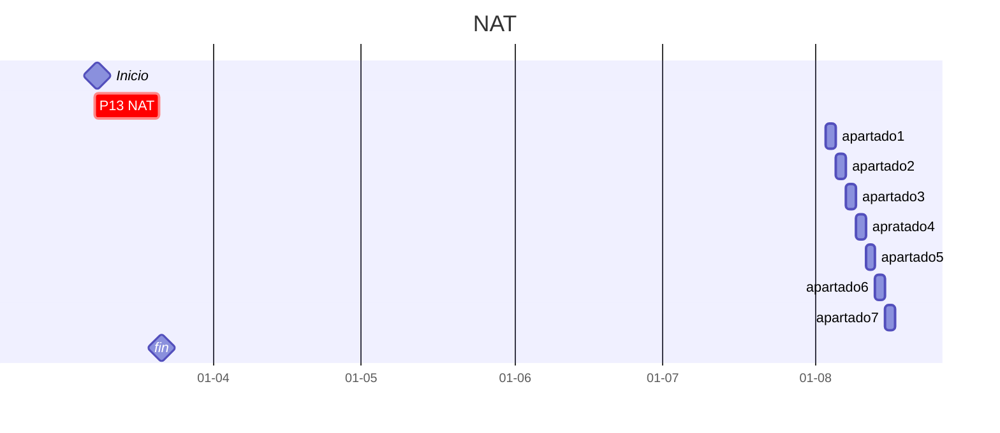

# Practica 9 NAT

```mermaid
gantt
    %%etiquetas posibles: done,active,crit,milestone
    title NAT
    dateFormat  DD-MM-YY
    axisFormat  %d-%m
    Inicio : milestone,08-03-22,1d

    P13 NAT             :crit,nat,08-03-22,21-03-22
    apartado1           :8-03-22,2d
    apartado2           :2d
    apartado3           :2d
    apratado4           :2d
    apartado5           :2d
    apartado6           :2d
    apartado7           :2d
    fin  : milestone,21-03-22,1d

```