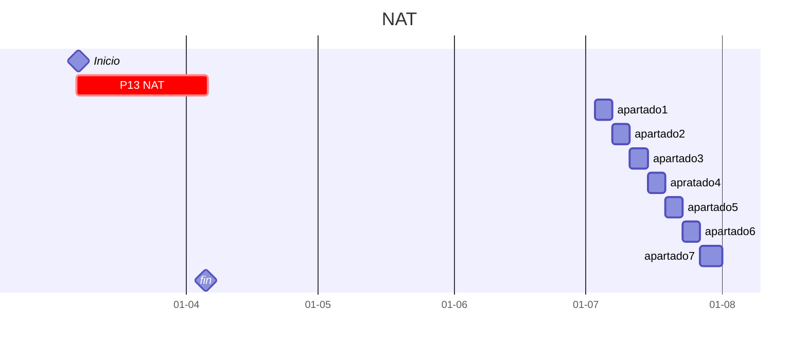

# Practica 9 NAT

```mermaid
gantt
    %%etiquetas posibles: done,active,crit,milestone
    title NAT
    dateFormat  DD-MM-YY
    axisFormat  %d-%m
    Inicio : milestone,07-03-22,1d

    P13 NAT             :crit,nat,07-03-22,30d
    apartado1           :7-03-22,4d
    apartado2           :4d
    apartado3           :4d
    apratado4           :4d
    apartado5           :4d
    apartado6           :4d
    apartado7           :5d
    fin  : milestone,05-04-22,1d

```