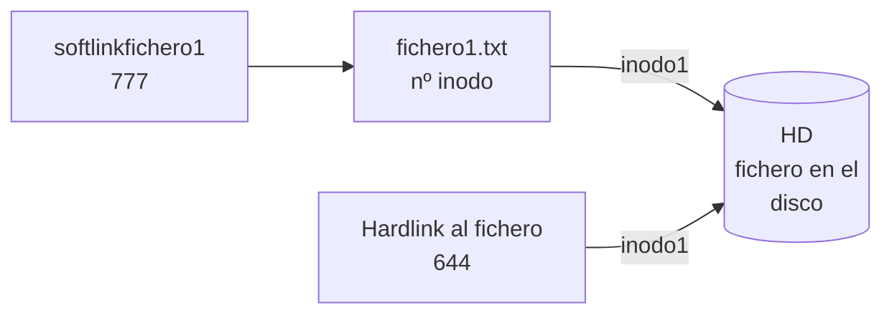

# hardlinks

```mermaid
    graph LR;
        c1[softlinkfichero1<br>777]-->c2[fichero1.txt<br>nº inodo]
        c2-->|inodo1|c3[(HD<br>fichero en el<br>disco)]
        c4[Hardlink al fichero<br>644]-->|inodo1|c3
        
```