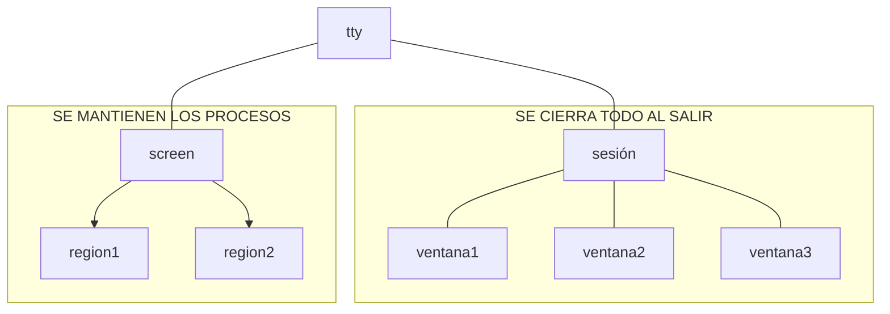

# Sesiones
* Creación de sesiones:
```bash
screen -S rrodriguez
```
* Para trabajar con las sesiones: CTRL + a:
    * ": ver las sesiones actuales. 
    * d: salir de la sesión sin cerrarla
    * c: crear otra instancia en la sesion actual
    * A: cambiar nombre
    * |: divide verticalmente para tener 2 regiones
    * S: divide horizontalmente
    * [TAB]: cambiar de región (necesito seleccionar una sesión)
    * 
* Conectarse a una sesión existente
```bash
screen -ls
screen -r 9740.rrodriguez
``` 



