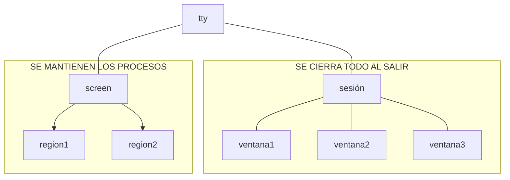

# Sesiones
* Creación de sesiones:
```bash
screen -S rrodriguez
```
* Para trabajar con las sesiones:<kbd  >Ctrl</kbd> + <kbd>a</kbd>:
    * <kbd>Shift</kbd>+<kbd>2</kbd>("): ver las sesiones actuales. 
    * <kbd>d</kbd>: salir de la sesión sin cerrarla
    * <kbd>c</kbd>: crear otra instancia en la sesion actual
    * <kbd>Shift</kbd>+<kbd>a</kbd>: cambiar nombre
    * <kbd>Alt Gr</kbd>+<kbd>1</kbd>(|): divide verticalmente para tener 2 regiones
    * <kbd>Shift</kbd>+<kbd>s</kbd>: divide horizontalmente
    * <kbd>Tab</kbd>: cambiar de región (necesito seleccionar una sesión)
    * 
* Conectarse a una sesión existente
```bash
screen -ls
screen -r 9740.rrodriguez
``` 



