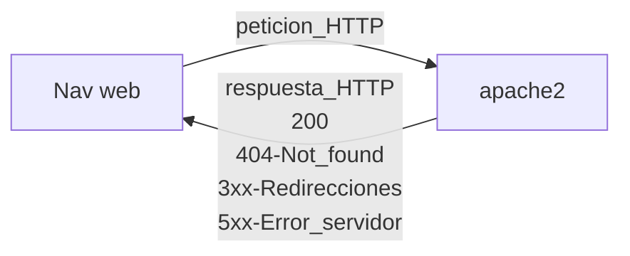

# HTML 5
Para indicar que son etiquetas vacías:
```html
<br/>
<!-- Los comentarios se hacen asi -->

```
Ejemplo hola mundo
```html
<!DOCTYPE html>
	<html lang="es">
		<head>
			<meta charset="utf-8" />
			<title>Hola Mundo!</title>
		</head>
		<body>
			<h1>Hola Mundo!</h1>
		</body>
	</html>
```
### Listas
```html
<ol>
	<li>Lista ordenada</li>
</ol>
<ul>
	<li>Lista no ordenada</li>
</ul>
```


se hace una petición por cada elemento que haya en la página (el html, imágenes..)
## Páginas web dinámicas:
se necesita que en el servidor exista un lenguaje de programación `web(PHP)` 