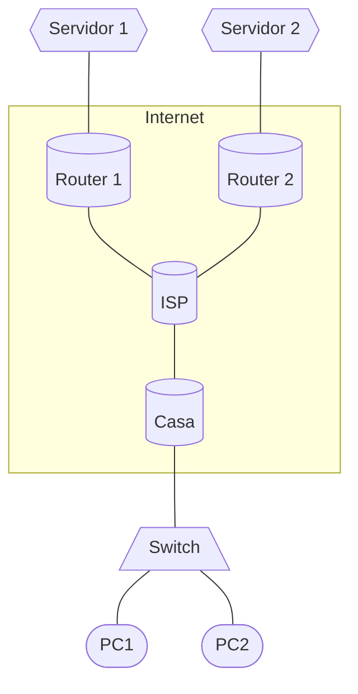
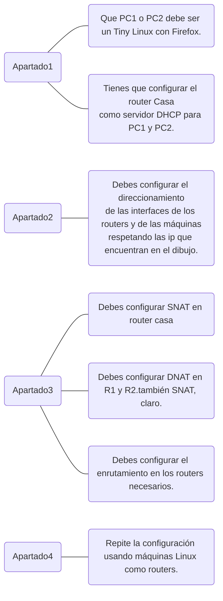

# Esquema P13 NAT
## Escenario:
1. PC1 y PC2 son dos ordenadores que tenemos en casa y que toman su dirección ip por DHCP del router "Casa".
2. El router "Casa" está conectado al Router "ISP" de nuestro proveedor de internet que es el que se comunica con los otros routers de internet.
3. Tenemos dos servidores Web (Server1 y Server2) que están en dos redes locales que se conectan al exterior por medio de dos routers (R1 y R2)
4. Queremos que desde PC1 o PC2 se pueda acceder a las páginas webs alojadas en Server1 y Server2.

## Esquema organización trabajo:
