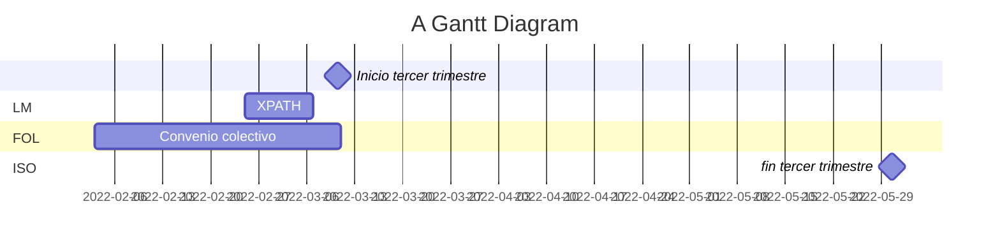

# pruebas mermaid

```mermaid
    gantt
    dateFormat HH:mm
    axisFormat %H:%M
    Initial milestone : milestone, m1, 23:15,2min
    taska2 : 10min
    taska3 : 5min
    Final milestone : milestone, m2, 23:31, 2min
    
```

```mermaid
gantt
    title A Gantt Diagram
    dateFormat  YYYY-MM-DD
    Inicio tercer trimestre : milestone,2022-03-10,1d
    section LM
    XPATH                   :a1, 2022-02-25, 2022-03-07

    section FOL
    Convenio colectivo      :2022-02-03,2022-03-11

    section ISO
    
    fin tercer trimestre : milestone,2022-05-30,1d
```